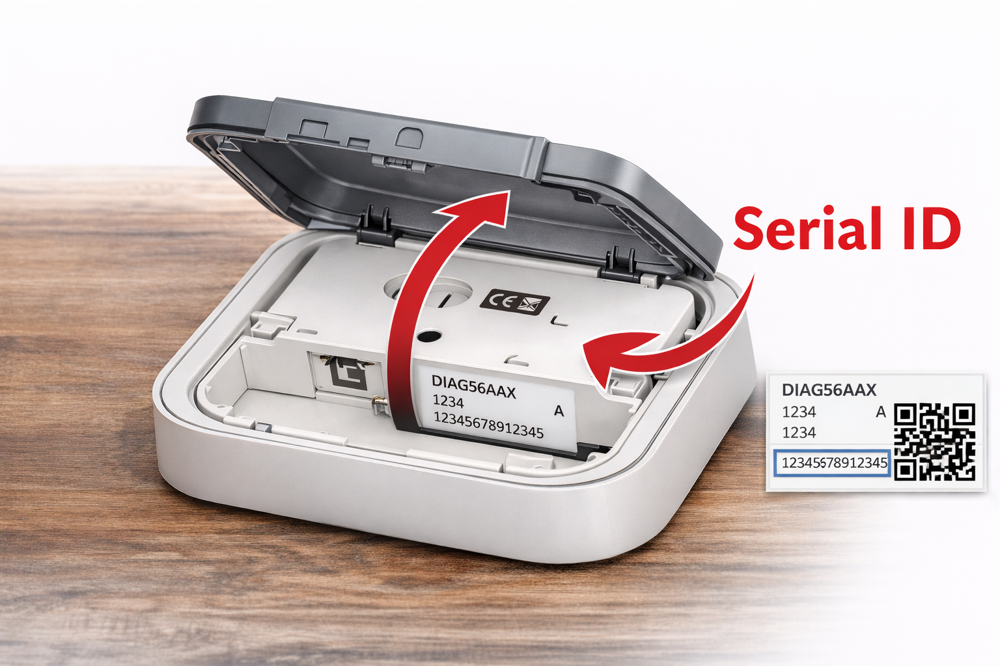

# Diagral for Homey Pro

Connect your Diagral alarm system to Homey Pro.

This app lets you control the alarm, read its current status, monitor anomalies, control individual groups, and use Homey Flow cards to automate actions when the alarm changes state.

## Features

- Arm and disarm the alarm from Homey
- Check the current alarm mode
- Monitor active groups
- Monitor anomalies
- Arm or disarm individual groups from Flows
- Use dedicated Flow triggers for:
  - alarm turned off
  - alarm armed partial
  - alarm armed full
  - alarm triggered
- Automatically generate API credentials from your Diagral account

## Installation

1. Install the app on Homey Pro.
2. Add the **Diagral Alarm** device.
3. Open the device **Advanced Settings**.
4. Enter:
   - the email address used for your Diagral eOne account
   - your account password
   - the Serial ID of your Diagral alarm and control box DIAG56AAX
   - the PIN code linked to your account
5. Save the settings.
6. Restart the app if needed.

Before saving, make sure there are no other active connections to the Diagral Cloud, including the Diagral eOne mobile app.

## Flow cards

### Triggers

- Alarm turned off
- Alarm armed partial
- Alarm armed full
- Alarm triggered

### Condition

- Alarm mode is...

### Actions

- Set alarm mode
- Set group state
- Refresh alarm status

## Notes

Use the Serial ID of your Diagral alarm and control box DIAG56AAX.

The Serial ID is a 14-character code located inside the box, on the label next to the QR code.

## Support

- Issues: https://github.com/lucaamo/homey-diagral/issues
- Source: https://github.com/lucaamo/homey-diagral
